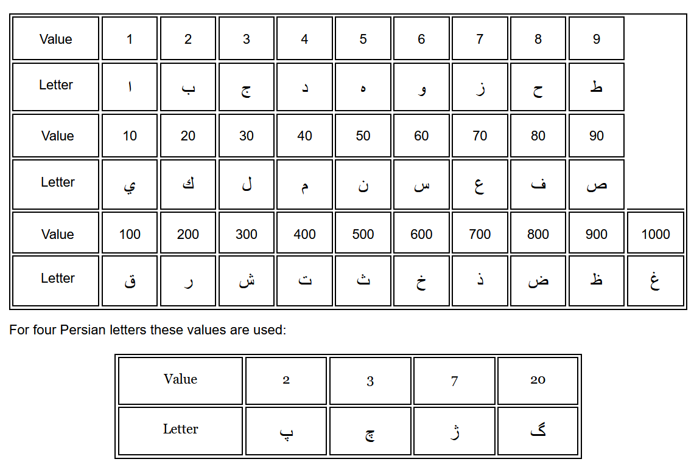

# Abjad-Calculator
The Abjad numerals, also called Hisab al-Jummal (Arabic: حِسَاب ٱلْجُمَّل‎, ḥisāb al-jummal), are a decimal alphabetic numeral system/alphanumeric code, in which the 28 letters of the Arabic alphabet are assigned numerical values.

