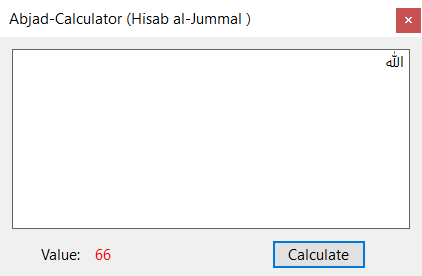
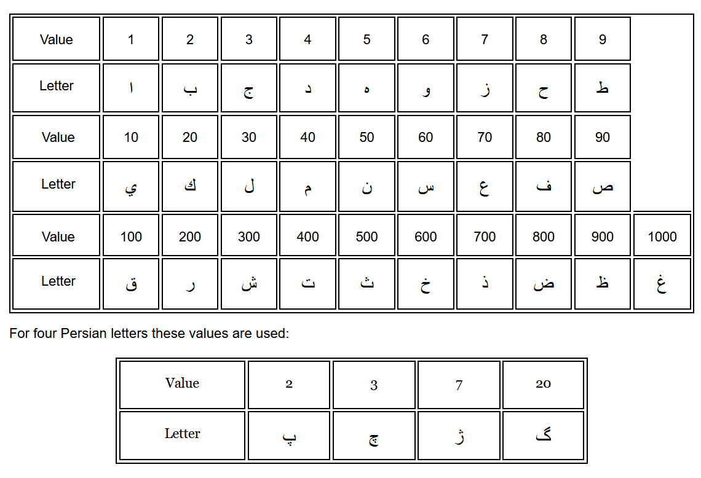

<div align="center">

# Abjad Calculator · حاسبة الجُمَّل

**Calculate the Abjad (Ḥisāb al-Jummal) value of any Arabic text: instantly, offline, free.**

[](https://github.com/moustafarhat/Abjad-Calculator/actions/workflows/ci.yml)
[](https://github.com/moustafarhat/Abjad-Calculator/releases/latest)
[](https://github.com/moustafarhat/Abjad-Calculator/releases)
[](LICENSE)


[English](#what-it-does) · [العربية](#بالعربية)



### [⬇ Download for Windows](https://github.com/moustafarhat/Abjad-Calculator/releases/latest)

No installation and no .NET required. Unzip and run `NumerologicalSystemCalculator.exe`.

</div>

## What it does

In the Abjad system each of the 28 Arabic letters is assigned a fixed numerical value. The value of a word is the sum of the values of its letters. The system has been used historically for chronograms, gematria, mnemonics, and numerology.

## Features

- Live calculation as you type — no need to press Calculate.
- Handles common orthographic variants automatically:
  - Hamza forms (أ، إ، آ، ٱ، ء، ؤ، ئ) fold onto their base letters.
  - Persian yāʾ (ی) and alif maqṣūra (ى) → ي.
  - Tāʾ marbūṭa (ة) → ه.
  - Diacritics (tashkīl ـَـِـُـّـْـ), tatweel (ـ), and whitespace are ignored.
  - Lām-alif ligatures (ﻻ ﻷ ﻹ ﻵ) decompose into ل + alif.
- Optional Persian mode maps پ→ب, چ→ج, ژ→ز, گ→ك.
- Unsupported characters are reported in a status line rather than silently zeroing the result.
- Copy-to-clipboard button.

## Abjad table (Mashriqī order)

| Letter | Value | Letter | Value | Letter | Value | Letter | Value |
|:------:|:-----:|:------:|:-----:|:------:|:-----:|:------:|:-----:|
| ا | 1   | ي | 10 | ق | 100 | ت | 400 |
| ب | 2   | ك | 20 | ر | 200 | ث | 500 |
| ج | 3   | ل | 30 | ش | 300 | خ | 600 |
| د | 4   | م | 40 |    |     | ذ | 700 |
| ه | 5   | ن | 50 |    |     | ض | 800 |
| و | 6   | س | 60 |    |     | ظ | 900 |
| ز | 7   | ع | 70 |    |     | غ | 1000 |
| ح | 8   | ف | 80 |    |     |   |     |
| ط | 9   | ص | 90 |    |     |   |     |



## Build & run

Requires the [.NET 8 SDK](https://dotnet.microsoft.com/download) on Windows.

```powershell
# from the repo root
dotnet build "Abjad Calculator.sln"
dotnet run --project "Abjad Calculator/NumerologicalSystemCalculator.csproj"
```

Or open `Abjad Calculator.sln` in Visual Studio 2022 (17.8+) and press F5.

## Tests

```powershell
dotnet test "Abjad Calculator.sln"
```

The test project (`Abjad Calculator.Tests`) covers the classical Abjad order, orthographic normalization, empty/null input, error reporting for unsupported characters, and the Persian mapping.

## Project structure

```
Abjad Calculator/
├── Core/
│   ├── CalculationBase.cs        // input preparation + summation
│   └── INumerologicalSystem.cs   // pluggable letter→value map
├── abjadSystem/
│   ├── AbjadValues.cs            // classical Arabic table + normalization
│   ├── PersianAbjadValues.cs     // Persian-letter mapping over the same table
│   └── AbjadCalculator.cs
├── Main.cs / Main.Designer.cs    // WinForms UI
└── Program.cs
```

To add another numerological system (e.g. Maghrebī Abjad ordering, Hebrew gematria), implement `INumerologicalSystem` and pass an instance to `AbjadCalculator`.

## Limitations

- The default Arabic table follows the **Mashriqī** (Eastern) order. The Maghrebī ordering swaps several values (ص, ض, ظ, غ) and is not implemented.
- Numerical digits inside the input are reported as unsupported — Abjad only operates on letters.
- The UI is Windows-only (Windows Forms). The `Core` and `abjadSystem` namespaces have no UI dependencies and can be reused on any .NET 8 target.

## بالعربية

<div dir="rtl">

**حاسبة الجُمَّل** برنامج مجاني يعمل دون اتصال بالإنترنت لحساب القيمة العددية لأي نص عربي بحساب الجُمَّل (الترتيب الأبجدي المشرقي).

- الحساب فوري أثناء الكتابة.
- توحيد تلقائي لصور الهمزة (أ، إ، آ، ء، ؤ، ئ)، والتاء المربوطة (ة ← ه)، والألف المقصورة (ى ← ي).
- تجاهل التشكيل والتطويل والمسافات.
- وضع اختياري للحروف الفارسية (پ، چ، ژ، گ).
- تنبيه عند وجود حروف غير مدعومة بدلاً من إعطاء نتيجة خاطئة.
- زر لنسخ النتيجة.

**التحميل:** نزّل أحدث إصدار من [صفحة الإصدارات](https://github.com/moustafarhat/Abjad-Calculator/releases/latest)، ثم فك الضغط وشغّل الملف مباشرة. لا يحتاج البرنامج إلى تثبيت.

</div>

## Contributing

Issues and pull requests are welcome, for example adding the Maghrebī ordering or other numerological systems (see *Project structure* above).

To make a release, push a version tag from `main` (e.g. `git tag v1.0.0; git push origin v1.0.0`). The Release workflow then builds the Windows executable and attaches it to a GitHub release.

## References

- [Abjad numerals — Wikipedia](https://en.wikipedia.org/wiki/Abjad_numerals)
- [Ḥisāb al-Jummal — Wikipedia (Arabic)](https://ar.wikipedia.org/wiki/%D8%AD%D8%B3%D8%A7%D8%A8_%D8%A7%D9%84%D8%AC%D9%85%D9%84)

## License

[MIT](LICENSE)
